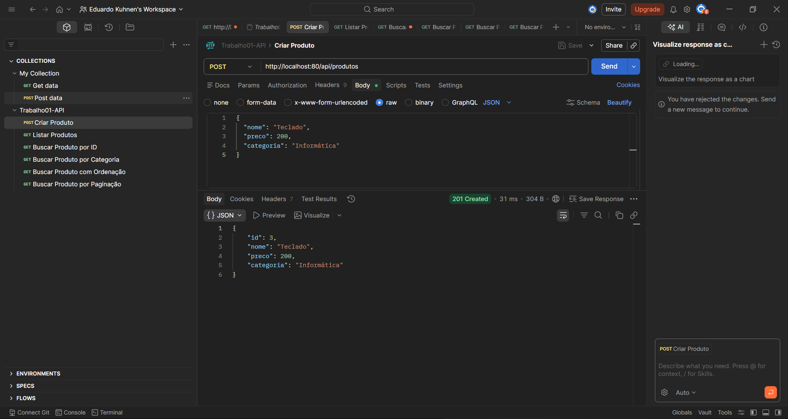
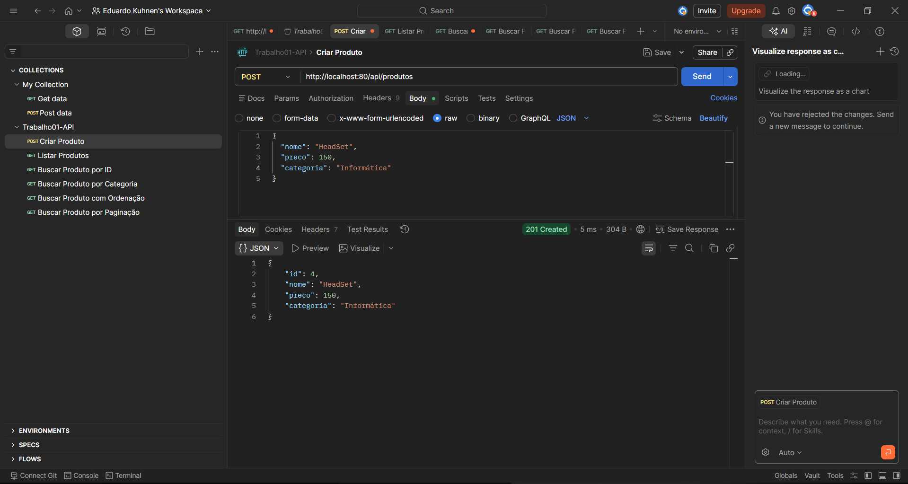
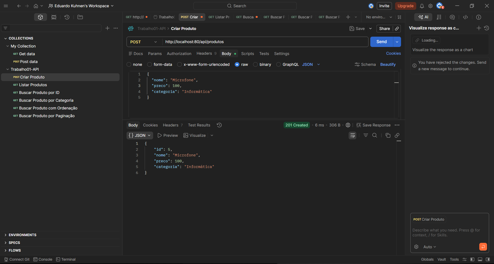
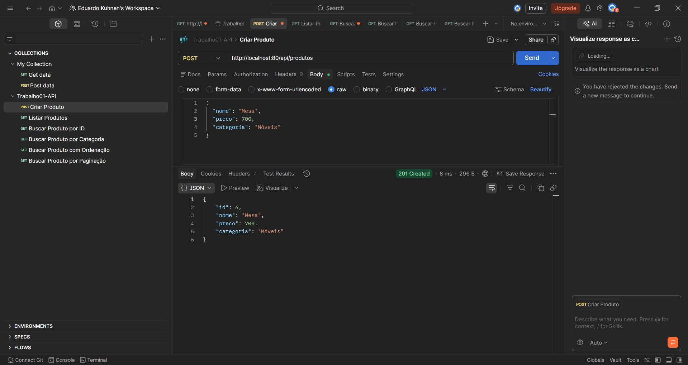
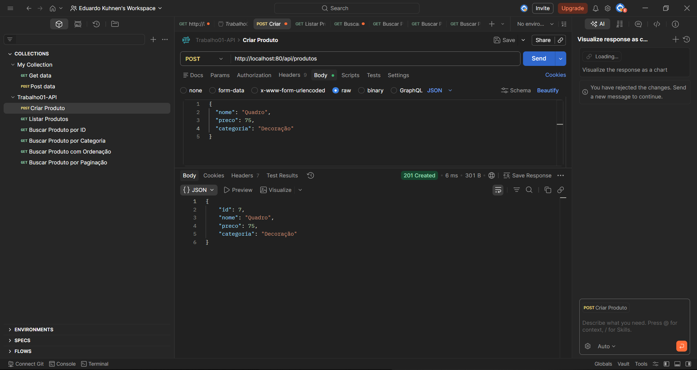
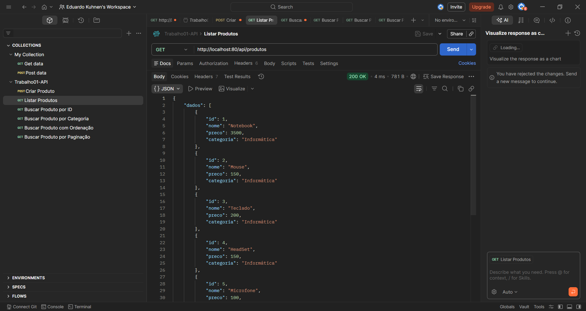
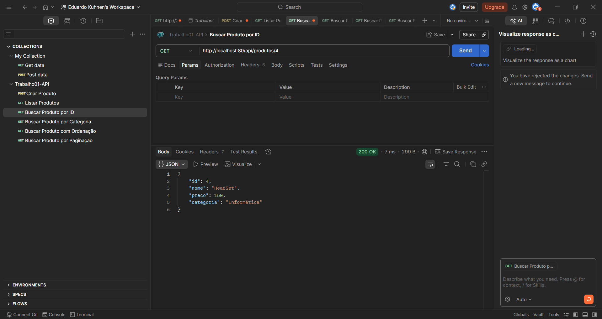
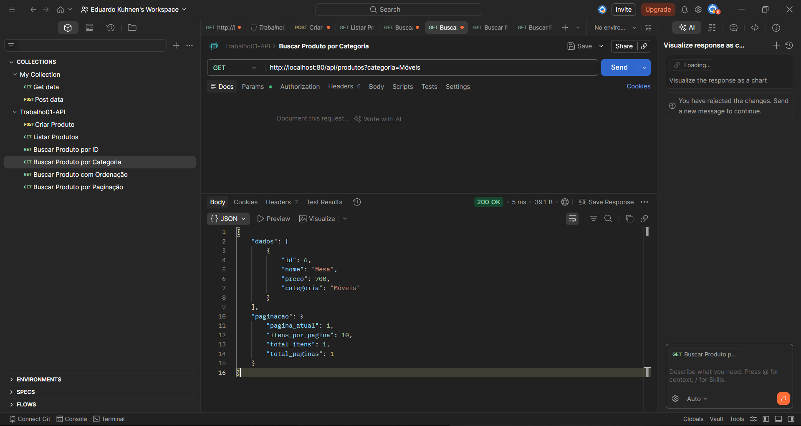
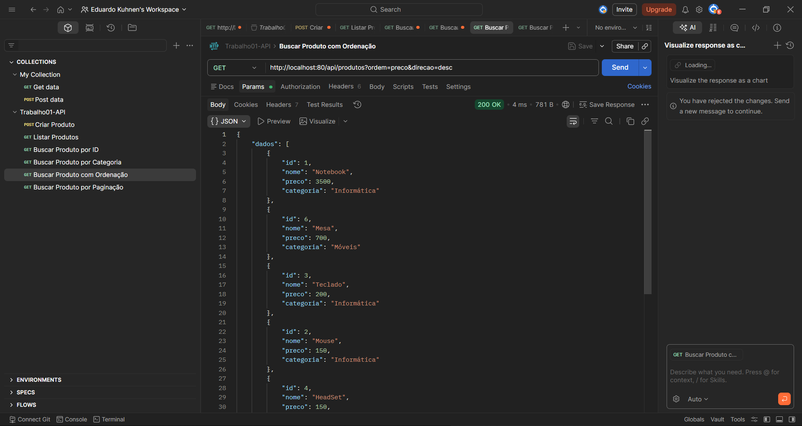
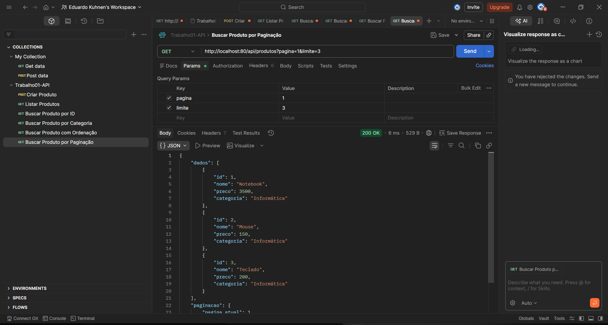

# API de Produtos

## Descrição

API REST desenvolvida em Node.js com Express para gerenciamento de produtos.
Permite criar, listar, filtrar, ordenar e paginar produtos.

---

## Tecnologias utilizadas

* Node.js
* Express
* Postman

---

## Endpoints

---

### POST /api/produtos

Cria um novo produto na API.

#### Body (JSON):

```json
{
  "nome": "Teclado",
  "preco": 200,
  "categoria": "Informática"
}
```

#### Campos:

* `nome` (string) → Nome do produto
* `preco` (number) → Valor do produto (deve ser maior que 0)
* `categoria` (string) → Categoria do produto

#### Resposta (201):

```json
{
  "id": 3,
  "nome": "Teclado",
  "preco": 200,
  "categoria": "Informática"
}
```

#### Possíveis erros:

* 400 → Nome não informado
* 400 → Preço inválido
* 400 → Categoria não informada

---

### GET /api/produtos

Retorna uma lista de produtos com suporte a filtros, ordenação e paginação.

#### Parâmetros de query:

* `categoria` → Filtra por categoria
* `preco_min` → Preço mínimo
* `preco_max` → Preço máximo
* `ordem` → Campo de ordenação (`preco` ou `nome`)
* `direcao` → Direção (`asc` ou `desc`)
* `pagina` → Número da página
* `limite` → Quantidade de itens por página

#### Exemplo de requisição:

```
/api/produtos?categoria=Informática&preco_max=500&ordem=preco&direcao=desc&pagina=1&limite=2
```

#### Resposta:

```json
{
  "dados": [
    {
      "id": 2,
      "nome": "Mouse",
      "preco": 150,
      "categoria": "Informática"
    }
  ],
  "paginacao": {
    "pagina_atual": 1,
    "itens_por_pagina": 2,
    "total_itens": 5,
    "total_paginas": 3
  }
}
```

---

### GET /api/produtos/:id

Retorna um produto específico com base no ID.

#### Exemplo:

```
/api/produtos/1
```

#### Resposta:

```json
{
  "id": 1,
  "nome": "Notebook",
  "preco": 3500,
  "categoria": "Informática"
}
```

#### Possíveis erros:

* 404 → Produto não encontrado
* 400 → ID inválido


## Testes no Postman

### Criando produtos (POST)

  
  
  
  


---

### Listar produtos



---

### Buscar produto por ID



---

### Filtro por categoria



---

### Ordenação



---

### Paginação


---

## Collection do Postman

A collection utilizada está disponível no arquivo:

```
postman_collection.json
```
